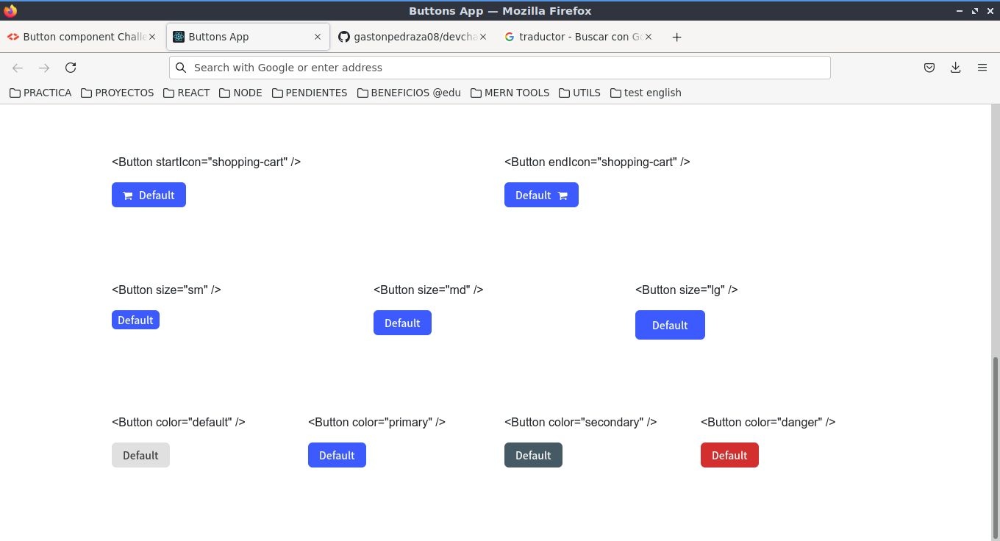

<!-- Please update value in the {}  -->

<h1 align="center">Buttons App</h1>

<div align="center">
   Solution for a challenge from  <a href="http://devchallenges.io" target="_blank">Devchallenges.io</a>.
</div>

<div align="center">
  <h3>
    <a href="https://amazing-meitner-009952.netlify.app/">
      Demo
    </a>
    <span> | </span>
    <a href="https://github.com/gastonpedraza08/devchallenges-buttons-app">
      Solution
    </a>
    <span> | </span>
    <a href="https://devchallenges.io/challenges/ohgVTyJCbm5OZyTB2gNY">
      Challenge
    </a>
  </h3>
</div>

<!-- TABLE OF CONTENTS -->

## Table of Contents

- [Overview](#overview)
  - [Built With](#built-with)
- [Features](#features)
- [How to use](#how-to-use)
- [Contact](#contact)
- [Acknowledgements](#acknowledgements)

<!-- OVERVIEW -->

## Overview




- You can see a demo [here](https://amazing-meitner-009952.netlify.app/)
- This challenge was important to understand the bases of the components in React and how they are optimized to be reused.
- I have learned to handle the logic in the components to optimize the styles applied with the css.

### Built With

<!-- This section should list any major frameworks that you built your project using. Here are a few examples.-->

- [React](https://reactjs.org/)
- [Bootstrap v4](https://getbootstrap.com/)
- [Font Awesome v4.7](https://fontawesome.com/v4.7/)

## Features

<!-- List the features of your application or follow the template. Don't share the figma file here :) -->

This application/site was created as a submission to a [DevChallenges](https://devchallenges.io/challenges) challenge. The [challenge](https://devchallenges.io/challenges/ohgVTyJCbm5OZyTB2gNY) is to optimize the styles of the css to obtain a large number of different buttons through properties similar to boostrap.

## How To Use

<!-- This is an example, please update according to your application -->

To clone and run this application, you'll need [Git](https://git-scm.com) and [Node.js](https://nodejs.org/en/download/) (which comes with [npm](http://npmjs.com)) installed on your computer. From your command line:

```bash
# Clone this repository
$ git clone https://github.com/gastonpedraza08/devchallenges-buttons-app

# Install dependencies
$ yarn install

# Run the app
$ yarn start
```

## Acknowledgements

<!-- This section should list any articles or add-ons/plugins that helps you to complete the project. This is optional but it will help you in the future. For exmpale -->

- [Steps to replicate a design with only HTML and CSS](https://devchallenges-blogs.web.app/how-to-replicate-design/)
- [Node.js](https://nodejs.org/)
- [Marked - a markdown parser](https://github.com/chjj/marked)

## Contact

- GitHub [https://github.com/gastonpedraza08](https://github.com/gastonpedraza08)
